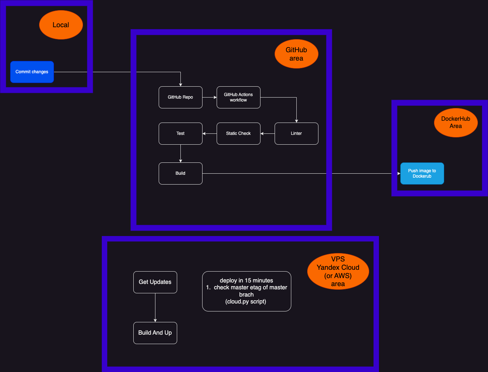

Basic Template for GitLab CI with integrations tests, pre-commit, badges, coverage, flake8 and mypy

* GitHub cicd with deploy to cloud
* pre-commit
* gitlab ci
* badges
* integration tests
* coverage & junit
* flake & black & mypy
* docker-compose

CICD Architecture
==================


Mirror gitlab
==================
[GitLab Mirror](https://gitlab.com/GavrilovStepan01/AwesomeGitLab)

Start Local
==

```shell
  ./entrypoint.sh Local
```

Local tests
==

```shell
  ./entrypoint.sh PreCommitTest
```

How commit ?
==

```shell
git add .pre-commit-config.yaml
```

```shell
pre-commit run --all-files --show-diff-on-failure
```

```shell
pre-commit clean
```
